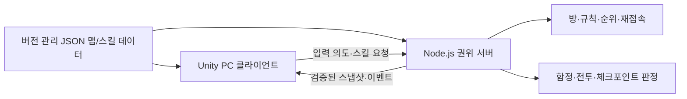
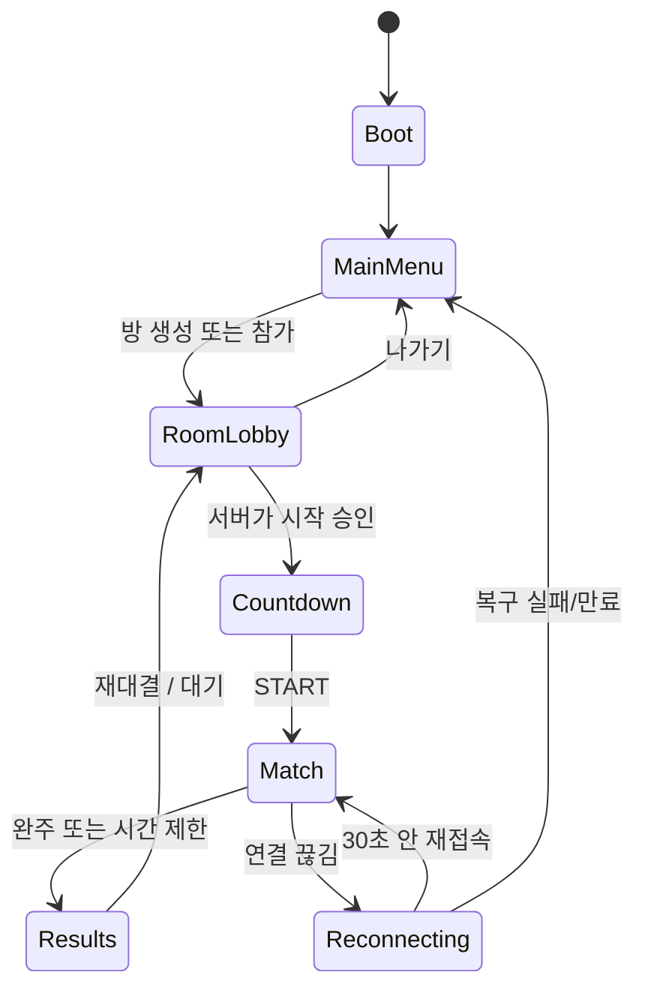

# Panic Marathon — Unity 3D 전환 개발 기획서

> 최종 갱신: 2026-07-28  
> 문서 상태: **3D 패키지 버전의 기준 기획 및 구현 순서**. 기존 웹 버전의 상세 게임 규칙은 [`plan.md`](./plan.md)를 기준으로 하며, 이 문서는 그 규칙을 Unity 3D로 옮기는 방법과 새로 결정해야 할 사항을 다룬다.  
> 개발 원칙: AI가 구현·자동 검증을 담당하고, 사람은 빌드를 실제로 플레이하며 재미와 오류를 판단한다.

---

## 1. 결론과 방향

### 1.1 엔진 선택

이 프로젝트의 3D 패키지 버전은 **Unity + C# + URP(Universal Render Pipeline)** 로 개발한다.

선택 이유는 다음과 같다.

- 목표 그래픽은 실사·대작 그래픽이 아니라, 색감이 강하고 과장된 **캐주얼 로우폴리 3D**다.
- 현재 게임은 2D 좌표 평면 위의 경쟁 레이스다. Unity의 `CharacterController`, 카메라, 충돌체, 저사양 빌드 구조가 이를 3D로 확장하기 적합하다.
- AI가 다루기 쉬운 텍스트 중심 C# 코드·JSON 데이터·자동 테스트 구조를 만들 수 있다.
- Windows/macOS PC 빌드와 반복 테스트를 가볍게 돌릴 수 있다.
- Unreal의 Blueprint·애니메이션 블루프린트·에디터 의존 워크플로보다, 사람이 직접 만져야 하는 GUI 설정량을 줄일 수 있다.

### 1.2 한 문장 목표

**2~6명이 장난감 같은 3D 트랙을 달리며 총·랜덤 스킬·함정으로 서로를 흔들고, 가장 먼저 정해진 랩을 완주하는 온라인 난투 레이싱 게임**을 만든다.

게임 감각은 "정교한 레이싱 시뮬레이터"보다, 캐릭터가 튕기고 미끄러지고 떨어져도 즉시 상황을 읽을 수 있는 **병맛 파티 레이싱**에 둔다.

### 1.3 출시 순서

처음부터 "3개 맵, 10개 스킬, 6인 온라인, 정식 캐릭터"를 동시에 만들지 않는다. 반드시 아래 순서를 지킨다.

```text
3D 회색 상자 1인 주행
  → 1개 맵에서 완주 가능한 게임 루프
  → 2인 온라인 경기
  → 3개 맵·10개 스킬·2~6인 온라인
  → 아트/사운드 교체·접근성·패키지 QA
```

각 단계에서 실제로 재미있는 한 판을 끝낼 수 있어야 다음 단계로 간다. 예쁜 모델이나 효과는 이 기준을 통과한 후 교체한다.

---

## 2. 제품 범위

### 2.1 첫 번째 출시 대상

| 항목 | 결정 |
| --- | --- |
| 플랫폼 | PC 데스크톱. Windows x86_64를 첫 배포 대상으로 하고 macOS 빌드는 QA 대상으로 유지한다. |
| 조작 | 키보드 + 마우스. `WASD` 이동, 마우스 조준, 좌클릭 기본 총, 우클릭 스킬, `Esc` 메뉴. |
| 인원 | 온라인 2~6명. 오프라인은 연습/개발 확인용 1인 모드만 제공한다. |
| 시점 | 탑다운보다 약간 낮은 **3/4 쿼터뷰 3D 카메라**. 캐릭터·트랙·낙하가 모두 읽혀야 한다. |
| 그래픽 | 색이 선명한 로우폴리 장난감 디오라마. 과도한 사실적 조명·고사양 효과를 목표로 하지 않는다. |
| 세션 | 방 생성/초대 코드/재대결을 유지한다. 계정, 상점, 랭크, 영구 전적은 첫 출시 범위 밖이다. |
| 서버 | 기존 Node.js + Socket.IO 서버를 당분간 권위 서버로 유지한다. Unity 클라이언트는 패키지로 배포하고 원격 서버에 접속한다. |

### 2.2 반드시 유지할 기존 게임 정체성

- 체크포인트 `1 → 2 → 3 → 결승선`을 순서대로 통과하는 랩 레이스
- 2~6인, 기본 5랩, 1~999랩 방장 설정, 최대 1시간 시간 제한
- 좌클릭 3발 기본 총 + 5 라이프 + 체크포인트/리스폰 시 탄창 회복
- 체크포인트마다 1개씩 무작위로 바뀌는 단일 스킬 슬롯
- 능동 스킬 7종과 자동 스킬 3종의 병맛 견제
- 말썽 운동장, 우주 정거장, 우당탕 산맥의 서로 다른 위험 규칙
- 서버가 최종적으로 판정하는 이동 한계, 전투, 함정, 체크포인트, 순위
- 게임 종료 뒤 결과·칭호·재대결로 이어지는 짧은 파티 게임 흐름

### 2.3 첫 출시에서 의도적으로 하지 않는 것

- 오픈 월드, 스토리 모드, NPC AI 전투, 8인 이상, 봇 대전
- 자유 카메라·1인칭 시점·복잡한 차량 물리
- 실사 렌더링, 레이트레이싱, 대규모 파괴, 포토리얼 캐릭터
- 스킨 상점, 결제, 랭크 매칭, 영구 계정/인벤토리
- 모바일·콘솔 동시 출시
- 웹 버전의 Canvas 렌더러를 Unity 안에 억지로 재사용하는 작업

이 항목들은 "절대 하지 않는다"가 아니라 첫 패키지 버전의 완성도를 지키기 위해 **보류한다**는 뜻이다.

---

## 3. 기존 웹 버전에서 가져올 것과 새로 만들 것

### 3.1 이 프로젝트는 변환이 아니라 재구현이다

현재 웹 버전의 `src/` 렌더러와 입력 코드는 Unity에서 재사용하지 않는다. Unity는 화면, 씬, 물리, 입력, 오디오, UI의 구조가 다르므로 3D 클라이언트는 새로 만든다.

반면 이미 검증된 **게임 규칙과 서버 권한 구조**는 최대한 보존한다. 특히 2~6인 방, 체크포인트 순서, 스킬 지급, 라이프, 상태 우선순위, 맵 위험 규칙은 새로 기획하지 않고 현재 값에서 출발한다.

| 기존 영역 | Unity 3D에서의 처리 | 비고 |
| --- | --- | --- |
| `src/main.ts`, Canvas 렌더러 | 새 Unity 씬, C# 프레젠테이션 코드로 교체 | 코드 재사용 없음 |
| 픽셀 캐릭터/배경 렌더링 | 로우폴리 캐릭터·프롭·VFX로 교체 | 게임 규칙은 유지 |
| 키보드·마우스 입력 | Unity Input System 액션으로 교체 | 조작 의미는 동일 |
| `shared/game-rules.mjs` | 서버 기준 값으로 유지하고 JSON 데이터로 공개 | C#과 JS에 숫자를 복사하지 않음 |
| `shared/geometry.mjs`, 맵 카탈로그 | Node 서버의 진실값 유지, Unity는 대응하는 월드 좌표/콜라이더를 읽음 | 단위 변환은 한 곳에서만 |
| `server/` Socket.IO 방·판정 | 초기 온라인 버전에서 계속 사용·확장 | 별도 서비스로 배포 |
| Node 자동 테스트 | 계속 유지 | 규칙 회귀를 막는 안전망 |
| Playwright 브라우저 E2E | 웹 버전 유지 목적이 아니라 서버 계약 검증에 활용 | Unity 전용 테스트는 별도 추가 |

### 3.2 서버 유지 전략

온라인 버전의 첫 목표는 "Unity에서 다시 서버를 전부 만드는 것"이 아니다. 이미 작동하는 Node 권위 서버를 활용해 3D 클라이언트를 연결한다.



이 방식의 장점은 다음과 같다.

- 기존 멀티플레이 기능과 자동 테스트를 버리지 않는다.
- Unity는 "보이는 3D 세계"와 로컬 조작감을 우선 책임질 수 있다.
- 클라이언트가 조작하기 쉬운 값을 보내도 서버가 최종 위치·피해·순위를 검증한다.
- 나중에 전용 Unity 서버나 다른 통신 기술로 옮기더라도, 게임 규칙 데이터와 테스트 시나리오를 보존할 수 있다.

**중요:** Unity 클라이언트가 `Transform.position`을 최종 진실값처럼 서버에 보내서는 안 된다. 이동 방향·입력 시퀀스·조준 방향·스킬 사용 의도만 보내고, 서버가 검증한 상태를 다시 보낸다. 초기 단계에서 기존 서버가 위치 제출 방식이라면, 2인 온라인이 안정된 뒤 입력 의도 중심 계약으로 점진 변경한다.

---

## 4. 3D 게임 경험 설계

### 4.1 카메라와 조작

기존의 탑다운 조작감을 잃지 않는 것이 핵심이다. 3D라고 해서 카메라를 캐릭터 뒤로 바짝 붙이는 TPS로 바꾸지 않는다.

| 항목 | 기본안 | 확인 기준 |
| --- | --- | --- |
| 카메라 각도 | 지면을 약 50~60도 내려다보는 쿼터뷰 | 앞쪽 함정과 뒤쪽 추격자를 동시에 볼 수 있어야 함 |
| 카메라 거리 | 캐릭터 속도·맵 구간에 따라 완만하게 조절 | 빠르게 달려도 화면 가장자리 밖에서 맞지 않아야 함 |
| 카메라 회전 | 기본은 월드 고정. 필요 시 맵별 고정 각도만 사용 | 마우스 조준과 방향 감각이 흔들리지 않아야 함 |
| 이동 | 카메라 기준 `WASD`의 지면 방향 | 대각선 이동 속도 정규화 필수 |
| 조준 | 마우스 광선을 지면 조준 평면에 투사해 캐릭터의 수평 방향을 계산 | 커서 위치와 총구 방향이 일치해야 함 |
| 발사 | 캐릭터가 조준 방향으로 회전하고, 투사체/VFX는 총구에서 출발 | 화면 중앙 조준 강제가 아님 |
| 점프 | 일반 점프 버튼은 넣지 않는다 | 점프대·넉백·그랩만 공중 이동을 만든다 |

### 4.2 이동과 물리의 기준

플레이어 이동에는 기본적으로 `CharacterController`를 사용한다. 일반 달리기에서 Rigidbody 물리 반동에 의존하지 않는다. 이유는 온라인 보정, 경사 처리, 분신 길막, AI 구현 안정성에서 예측 가능한 결과가 필요하기 때문이다.

- 지상 이동: 수평 속도 벡터를 직접 계산해 컨트롤러에 적용한다.
- 중력: 공중부양이 아닐 때만 명시적으로 적용한다.
- 넉백/그랩/점프대: 서버가 시작·종료·도착 위치를 결정하고, 클라이언트는 지정된 곡선/보간으로 표현한다.
- 구덩이/우주 추락: 실제 물리 낙하를 판정 수단으로 쓰지 않는다. 서버의 `falling` 상태를 받으면 사라지는 연출과 리스폰만 재생한다.
- 분신/거대화 충돌: 서버가 판정한다. 클라이언트 콜라이더는 즉각적인 시각 피드백과 로컬 이동 감각에만 쓴다.
- 투사체: 기본 총·수면총·슬로우탄의 명중은 서버 기준이다. Unity의 Raycast/Projectile은 예측 VFX일 뿐 최종 피해를 결정하지 않는다.

### 4.3 좌표계와 스케일

서버 2D 좌표 `(x, y)`는 Unity 지면 `(x, z)`로 투영한다. Unity의 `y`는 높이 전용이다.

```text
server (x, y)  →  Unity (x * worldUnitsPerServerUnit, height, y * worldUnitsPerServerUnit)
```

- 초기값은 `worldUnitsPerServerUnit = 0.05`로 두고, 기존 이동 속도 `110`이 약 `5.5m/s`로 느껴지는지 한 맵에서 검증한다.
- 이 변환 계수는 `WorldCoordinateMapper` 단 한 곳에서만 관리한다. 씬, 프리팹, 서버 코드 곳곳에 `0.05`를 쓰지 않는다.
- 플레이어 기본 키는 약 1.7~1.9 Unity 단위, 기본 캡슐 반지름은 약 0.35~0.45 단위에서 시작한다.
- 맵 프롭과 충돌체는 서버의 안전 영역과 같은 기준선에 맞춘다. 보이는 벽과 서버에서 막히는 벽의 오차가 느껴지면 안 된다.

### 4.4 시각 언어

3D가 되더라도 "왜 맞았는지 한 프레임 안에 알 수 있어야 한다"는 기존 원칙을 유지한다.

| 요소 | 3D 표현 원칙 |
| --- | --- |
| 플레이어 | 큰 실루엣, 머리 장식/색상, 이름표. 멀리서도 서로 구분되는 색 조합. |
| 기본 총 | 짧은 밝은 궤적, 맞은 캐릭터의 즉시 플래시와 짧은 넉백. |
| 밀치기 | 바닥 원형 충격파 + 바깥 방향 화살표/먼지. |
| 돌진/질주 | 잔상과 바닥 스피드 라인. 둘의 색·형태를 다르게 한다. |
| 그랩 | 굵은 로프/손 모양 라인과 왕복 경로. 발사자·대상이 동시에 잠긴다는 표시. |
| 분신 | 반투명하지만 충돌 가능한 실루엣, 남은 시간 감소 연출. |
| 슬로우탄 | 청록색 투사체·범위 링·느린 오라. |
| 수면총 | 보라색 투사체·`Zzz`·캐릭터 상단 상태 아이콘. |
| 구덩이 | 열리기 전 노란 위험 표식 → 열린 뒤 강한 대비의 깊이. |
| 점프대 | 진행 반대 방향을 명확히 가리키는 큰 화살표와 강한 탄성 모션. |
| 우주 추락 | 난간 밖으로 밀리면 짧은 공중 이탈 후 별빛 속으로 축소. |
| 산맥 낙석 | 그림자 원 → 낙하 암석 → 먼지. 그림자 없는 즉사 공격은 금지. |

### 4.5 아트 품질의 목표선

"메챠 카멜레온"처럼 캐릭터성과 장난감 같은 3D 공간을 목표로 하되, 특정 게임의 모델·UI·맵을 복제하지 않는다. 참고하는 것은 **밝은 실루엣, 과장된 모션, 쉽게 읽히는 상호작용**이다.

- 저폴리 메시, 평면에 가까운 색면, 제한된 팔레트, 굵은 그림자를 우선한다.
- 각 맵은 멀리서도 다른 색/실루엣을 가진다: 운동장=밝은 고무·플라스틱, 우주=어두운 금속·보라빛 우주, 산맥=흙·회색 암석·침엽수.
- 동일한 기능의 오브젝트는 동일한 시각 규칙을 쓴다. 예: 모든 위험 구역은 경고색 테두리와 바닥 표식을 가진다.
- 화면이 작은 플레이어도 읽을 수 있도록, 중요한 상태는 색만이 아니라 아이콘·형태·움직임까지 다르게 한다.

---

## 5. 기술 아키텍처

### 5.1 Unity 프로젝트 기준

| 영역 | 기본 결정 |
| --- | --- |
| Unity | 안정된 Unity 6 LTS 계열을 프로젝트 시작 시 고정한다. 개발 도중 메이저 버전을 올리지 않는다. |
| 렌더링 | URP. 모바일 수준의 과도한 최적화는 하지 않되, 저사양 노트북에서도 테스트 가능한 품질 설정을 둔다. |
| 언어 | C#만 사용한다. 핵심 게임 규칙을 Visual Scripting으로 만들지 않는다. |
| 입력 | Unity Input System. 입력 정의는 코드/`.inputactions` 파일로 버전 관리한다. |
| 카메라 | Cinemachine 등 공식 패키지를 쓰되, 카메라 로직의 핵심 값은 코드와 설정 파일에 남긴다. |
| UI | UI Toolkit 또는 uGUI 중 하나로 시작해 혼용하지 않는다. 빠른 게임 HUD에는 uGUI, 메뉴/설정에는 UI Toolkit을 검토하되 초기에 한 체계로 통일한다. |
| 오디오 | Unity Audio Mixer로 BGM·효과음·UI의 볼륨을 분리한다. |
| 저장 | 로컬 설정(볼륨·해상도·키 설정)만 저장한다. 경기 상태·전적은 서버 권한이다. |
| 빌드 | 개발 빌드와 배포 빌드를 분리하고, 명령줄 빌드 스크립트를 제공한다. |

### 5.2 권장 폴더 구조

Unity 프로젝트는 현재 웹 프로젝트와 같은 저장소 안에서 `unity-client/` 폴더로 독립시킨다. 기존 `src/`, `server/`, `shared/`를 옮기거나 덮어쓰지 않는다.

```text
panic-marathon/
├── plan.md                         # 웹 버전의 규칙 기준 문서
├── unity-plan.md                   # 이 문서
├── server/                         # 기존 Node 권위 서버
├── shared/                         # 서버 규칙·검증·데이터 원본
├── game-data/                      # Unity와 서버가 함께 읽는 JSON 원본(단계적으로 도입)
│   ├── maps/
│   ├── skills/
│   └── balance/
└── unity-client/
    ├── Assets/
    │   ├── Art/
    │   │   ├── Characters/
    │   │   ├── Environment/
    │   │   ├── Materials/
    │   │   ├── VFX/
    │   │   └── UI/
    │   ├── Audio/
    │   ├── Data/
    │   │   ├── ImportedGameData/
    │   │   └── Presentation/
    │   ├── Prefabs/
    │   │   ├── Players/
    │   │   ├── Gameplay/
    │   │   ├── Maps/
    │   │   └── UI/
    │   ├── Scenes/
    │   │   ├── Bootstrap.unity
    │   │   ├── MainMenu.unity
    │   │   ├── Arena_Playground.unity
    │   │   ├── Arena_SpaceStation.unity
    │   │   └── Arena_Mountain.unity
    │   ├── Scripts/
    │   │   ├── Bootstrap/
    │   │   ├── Core/
    │   │   ├── Input/
    │   │   ├── Camera/
    │   │   ├── Player/
    │   │   ├── Gameplay/
    │   │   ├── Maps/
    │   │   ├── Network/
    │   │   ├── Presentation/
    │   │   ├── UI/
    │   │   └── Tests/
    │   ├── Settings/
    │   └── StreamingAssets/GameData/
    ├── Packages/
    ├── ProjectSettings/
    └── build/
```

### 5.3 코드 책임 경계

| 계층 | 책임 | 해서는 안 되는 일 |
| --- | --- | --- |
| `Core` | 부트스트랩, 게임 상태 전환, 설정, 시간, 의존성 조립 | 스킬별 계산을 직접 들고 있지 않음 |
| `Input` | 키·마우스·UI 입력을 의미 있는 명령으로 변환 | 서버 상태를 수정하지 않음 |
| `Player` | 로컬 이동 표현, 캐릭터 회전, 애니메이션 파라미터 | 승패·피해·체크포인트를 단독 판정하지 않음 |
| `Gameplay` | 클라이언트 예측, 스킬 VFX, 상태 시각화 | 최종 규칙의 유일한 원본이 되지 않음 |
| `Maps` | 맵 로딩, 좌표 변환, 로컬 콜라이더·프롭·위험 연출 | 서버와 다른 맵 경계를 독단적으로 만들지 않음 |
| `Network` | Socket.IO 연결, DTO 직렬화, 입력 송신, 스냅샷 수신·보간 | UI 객체나 프리팹을 직접 조작하지 않음 |
| `Presentation` | 모델, 파티클, 사운드, 카메라 흔들림, 화면 효과 | 네트워크 판정을 바꾸지 않음 |
| `UI` | 메뉴, HUD, 결과, 오류 표시 | 게임 물리/서버 통신을 직접 구현하지 않음 |

### 5.4 상태 흐름



화면 상태와 네트워크 경기 상태를 혼동하지 않는다. 예를 들어 Unity 씬은 `Arena_Playground`에 남아 있어도 서버의 경기 상태는 `waiting`, `countdown`, `running`, `finished`일 수 있다.

### 5.5 데이터 원본 원칙

숫자와 규칙이 C#·JavaScript·프리팹에 각각 복사되면 반드시 어긋난다. 따라서 다음 원칙을 둔다.

1. 스킬 수치, 맵 체크포인트, 위험 범위, 속도 배율, 상태 우선순위는 버전 관리되는 `game-data/*.json`에서 시작한다.
2. Node 서버는 해당 데이터로 검증한다.
3. Unity는 같은 JSON을 읽어 HUD, 범위 표시, 맵 프롭 배치, 로컬 예측에 사용한다.
4. Unity `ScriptableObject`는 소재·색상·사운드·프리팹처럼 **표현 전용 데이터**에만 사용한다.
5. 서버 판정이 바뀌는 PR/작업에는 Node 테스트가 반드시 포함된다.

예시 데이터 책임은 아래와 같다.

```json
{
  "id": "slow-orb",
  "kind": "active",
  "cooldownSeconds": 4.6,
  "display": {
    "icon": "slow_orb",
    "color": "#2FE2D0"
  }
}
```

서버 판정에 필요한 반경·피해·지속 시간과 Unity의 아이콘·색상은 같은 식별자를 쓰되, 프리팹 경로를 서버 데이터에 넣지 않는다.

---

## 6. 네트워크 설계

### 6.1 권위 모델

| 주체 | 권한 |
| --- | --- |
| Unity 클라이언트 | 입력 수집, 즉시 반응용 로컬 예측, 보간, VFX·사운드·UI 표현 |
| Node 권위 서버 | 방, 참가자, 카운트다운, 허용 입력, 이동 한계, 충돌 결과, 전투, 함정, 체크포인트, 스킬 추첨, 순위, 재접속 |
| 게임 데이터 | 수치와 식별자의 공통 기준 |

클라이언트는 빠르게 반응해야 하지만 결과를 확정하지 않는다. 예를 들어 로컬에서 총구 불꽃은 즉시 보여도, 체력 감소·명중·리스폰은 서버 이벤트를 받은 뒤 확정한다.

### 6.2 통신 계약의 목표

초기 Unity 어댑터는 기존 Socket.IO 이벤트를 최대한 유지한다. 장기적으로 아래 형태로 정리한다.

| 흐름 | 예시 내용 | 빈도/성격 |
| --- | --- | --- |
| 클라이언트 → 서버: 입력 | 시퀀스 번호, 이동 축, 조준 각도, 누른/뗀 입력 | 일정 주기 및 변화 시 |
| 클라이언트 → 서버: 행동 요청 | 기본 총 발사, 현재 스킬 사용, 채팅, 방 관리 | 이벤트성 |
| 서버 → 클라이언트: 스냅샷 | 서버 시간, 플레이어 위치/방향/상태, 경기 진행도, 함정 상태 | 일정 주기 |
| 서버 → 클라이언트: 확정 이벤트 | 피격, 스킬 시작/종료, 낙하, 리스폰, 체크포인트, 결과 | 이벤트성 |
| 서버 → 클라이언트: 연결 상태 | 재접속 토큰, 오류 코드, 대기/카운트다운 상태 | 이벤트성 |

입력에는 단조 증가하는 `sequence`를 넣고, 스냅샷에는 서버 시간이 포함되어야 한다. 이 두 값이 있어야 지연 원인을 기록하고 클라이언트 보정을 안정적으로 구현할 수 있다.

### 6.3 보간과 예측

- 다른 플레이어: 서버 스냅샷 사이를 약 100ms 버퍼로 보간한다. 순간이동·리스폰·낙하·그랩 시작처럼 불연속 사건은 보간하지 않고 이벤트로 처리한다.
- 내 캐릭터: 입력 직후 로컬에서 움직인다. 이후 서버 스냅샷과 차이가 작으면 부드럽게 보정하고, 차이가 크면 짧은 시간 안에 안전하게 끌어온다.
- 강제 이동: 넉백, 그랩, 점프대는 서버 이벤트의 시작 시간과 목표 위치를 사용한다. 물리 힘을 각 클라이언트가 따로 계산하지 않는다.
- 네트워크 지연: 첫 버전은 18~20Hz 스냅샷과 30Hz 이하 입력 전송에서 시작한다. 이 값은 2·4·6인 실측 후 조정한다.
- 재접속: 기존 고정 플레이어 ID·재접속 토큰·30초 보존 정책을 Unity 클라이언트에서도 동일하게 사용한다.

### 6.4 온라인 개발의 단계적 계약

1. **오프라인 단계:** `LocalMatchSimulator`가 서버 스냅샷과 같은 C# DTO를 만들어 Unity 표시 계층을 구동한다.
2. **연결 단계:** Unity `NetworkClient`가 실제 서버 연결, 방 생성/참가, 스냅샷 표시만 한다. 아직 조작은 하지 않는다.
3. **2인 조작 단계:** 이동, 조준, 기본 총, 체크포인트만 연결한다.
4. **행동 단계:** 스킬과 함정을 하나씩 연결한다.
5. **복원력 단계:** 재접속, 방장 위임, 재대결, 오류 화면, 부하 검증을 붙인다.

이 순서를 지키면 네트워크 오류가 "3D 씬 문제인지, 규칙 문제인지, Socket.IO 연결 문제인지" 분리된다.

---

## 7. 맵 3D 기획

### 7.1 공통 맵 제작 규칙

- 게임 플레이 평면과 충돌 범위를 먼저 회색 상자로 만든 뒤, 장식 메시를 올린다.
- 실제 주행면, 안전 벽, 낙하 영역, 체크포인트, 위험 영역을 각각 별도 레이어/기즈모로 확인 가능하게 만든다.
- 맵 프리팹에는 `MapId`, 좌표 변환 기준점, 체크포인트 앵커, 서버 위험 ID를 반드시 둔다.
- 보이는 오브젝트와 서버 판정 영역의 차이는 얇은 장식이 아닌 이상 0.2m 이내로 맞춘다.
- 길을 막는 장식물은 플레이어 충돌체를 가진다. 단순 배경 프롭은 충돌체를 제거해 경로가 답답해지지 않게 한다.
- 모든 위험은 접근 전 경고, 발동 순간, 결과의 세 단계를 가진다.

### 7.2 말썽 운동장 — 첫 번째 3D 수직 슬라이스

| 구분 | 3D 구성 |
| --- | --- |
| 공간 | 학교 운동장 같은 타원형/사각 트랙, 중앙은 장난감 장애물과 관람 소품이 있는 내야 |
| 색 | 러닝 트랙의 빨강·파랑, 밝은 잔디, 노란 안전선 |
| 주행면 | 넓고 평평하며 처음 플레이하는 사람이 조준·이동을 익히기 쉬움 |
| 경계 | 넘을 수 없는 낮은 고무 난간. 서버에서도 안전하게 밀치기 도착점을 제한 |
| 회전봉 | 중앙 또는 구간 교차점에 큰 폼봉 형태. 방향과 충돌 면적이 멀리서 읽혀야 함 |
| 랜덤 구덩이 | 바닥 타일이 갈라지고 경고등이 켜진 뒤 아래로 열림. 닫힌 타일과 열린 타일 모두 명확히 구분 |
| 역방향 점프대 | 대형 스프링 패드와 반대 방향 화살표. 밟으면 뒤로 날아감 |
| 역할 | 첫 완주 가능 버전, 모든 공통 시스템의 기준 맵 |

**완료 기준:** 큐브 캐릭터 두 명으로도 5랩을 끝낼 수 있고, 구덩이·회전봉·점프대의 원인이 영상 없이 눈으로 이해된다.

### 7.3 우주 정거장 — 추락 위험 맵

| 구분 | 3D 구성 |
| --- | --- |
| 공간 | 우주 공간 위에 떠 있는 좁은 금속 통로와 분기 플랫폼 |
| 색 | 어두운 남색·보라 배경, 차가운 금속 바닥, 네온 안내선 |
| 핵심 위험 | 트랙 밖으로 밀려나거나 경계를 넘으면 추락 → 서버 판정 리스폰 |
| 시각 피드백 | 난간 끝, 위험 스트라이프, 아래의 별/행성으로 거리감을 즉시 인지 |
| 공중부양 | 지상 위험을 피해 짧게 단축할 수 있으나, 서버가 허용하는 안전 영역 규칙을 명확히 표시 |
| 거대화 | 몸은 커져도 추락 면역이 아니다. 넓은 몸 때문에 경계 근처에서 더 위험할 수 있음 |
| 역할 | 밀치기·그랩·공중부양이 만드는 위험/기회 차이를 가장 강하게 보여주는 맵 |

**완료 기준:** 낙사는 억울하지만 "왜 떨어졌는지"가 확실하고, 카메라가 경계 밖을 충분히 보여 줘 회피할 여지가 있다.

### 7.4 우당탕 산맥 — 직선 오르막·낙석 맵

| 구분 | 3D 구성 |
| --- | --- |
| 공간 | 산 아래에서 정상까지 이어지는 넓은 오르막 직선, 절벽·암벽·침엽수로 양옆 구성 |
| 색 | 흙길·회색 바위·초록 나무, 정상의 밝은 깃발/종점 |
| 진행 | 체크포인트 3개를 지나 정상 결승. 다음 랩이 남으면 출발점으로 서버 순간이동 |
| 핵심 위험 | 서버가 굴리는 낙석. 암벽 프롭에 닿으면 소멸 |
| 제외 요소 | 기존 구덩이·점프대·회전봉을 섞지 않는다. 낙석과 오르막 난투의 개성을 보존 |
| 역할 | 선두를 직접 쫓는 스킬, 길막 분신, 낙석 회피가 만드는 긴 직선 경쟁 |

**완료 기준:** 출발→정상→다음 랩 이동이 혼동되지 않고, 낙석의 그림자·궤적·소멸 규칙을 이해할 수 있다.

---

## 8. 캐릭터·애니메이션·에셋 제작 기획

### 8.1 캐릭터 제작 전략

AI만으로 개발하는 경우, 가장 위험한 자산은 "매번 비율과 본이 달라지는 AI 생성 캐릭터"다. 초기에는 하나의 검증된 리그를 가진 공통 캐릭터를 만들고, 색·머리 장식·소품으로 플레이어를 구분한다.

| 단계 | 캐릭터 방식 | 목적 |
| --- | --- | --- |
| 회색 상자 | 캡슐/큐브 + 색상 머티리얼 | 이동·충돌·카메라 확인 |
| 프로토타입 | 단순 저폴리 마스코트 1종 + 공통 리그 | 애니메이션과 실루엣 확인 |
| 알파 | 몸 색상, 머리 장식, 얼굴 스티커, 총 소품의 조합 | 6명 즉시 구분 |
| 베타 | 필요한 경우 외부 제작/라이선스 확인 에셋을 같은 리그 규격으로 교체 | 품질 개선 |

캐릭터는 최초에 최소 아래 동작만 필요하다.

- 대기, 달리기, 피격, 수면, 넉백/공중, 추락, 승리, 패배
- 총 발사와 스킬은 별도 전신 애니메이션보다 상체/소품·VFX 중심으로 시작한다.
- 네트워크 상태로 애니메이션을 동기화하지 않는다. 위치·상태 이벤트를 받아 각 클라이언트가 동일한 표현을 재생한다.

### 8.2 플레이어 식별 규칙

6명의 캐릭터가 겹쳐도 구분할 수 있어야 한다.

1. 몸통 기본색은 서로 명도 차가 큰 6색 팔레트로 고정한다.
2. 머리 위 이름표와 작은 색 아이콘을 항상 표시한다.
3. 로컬 플레이어는 아주 얇은 바닥 링과 UI 강조를 가진다.
4. 아군/적군 구분이 아니라 **각 플레이어 개인 식별**이 목적이므로 빨강=적 같은 규칙에 묶지 않는다.
5. 색각 이상 사용자를 위해 이름 이니셜/도형 모양도 함께 둔다.

### 8.3 AI 에셋 사용 규칙

- AI 이미지는 콘셉트 보드, 텍스처 초안, UI 아이콘 방향을 정하는 데 사용할 수 있다.
- 실제 게임에 넣는 외부/생성 에셋은 상업 사용 권리, 출처, 라이선스를 `ASSET-LICENSES.md`에 기록한다.
- 리그가 필요한 3D 캐릭터는 "모델 생성 → 리깅 → 애니메이션 → Unity 임포트" 전 과정을 한 번에 믿지 않는다. 샘플 1종을 게임 안에서 달리게 한 뒤에만 변형을 늘린다.
- 메시에 충돌체를 자동 생성해 게임 규칙을 결정하지 않는다. 게임용 콜라이더는 단순한 별도 형태로 설계한다.
- 에셋을 교체해도 프리팹의 `PlayerVisual`, `Animator`, `WeaponSocket`, `NameplateAnchor` 계약은 유지한다.

### 8.4 프롭과 VFX 우선순위

첫 아트 패스에서는 맵 전체의 디테일보다 아래 순서를 우선한다.

1. 캐릭터 실루엣과 조준 방향
2. 체크포인트·결승선·경계
3. 구덩이·점프대·낙석 같은 위험 경고
4. 스킬별 색/형태/범위 차이
5. 멀리 보이는 배경 프롭과 장식

---

## 9. UI·오디오·접근성 기획

### 9.1 화면 구성

| 화면 | 필수 기능 | 구현 순서 |
| --- | --- | --- |
| 시작 화면 | 게임 시작, 설정, 종료, 서버 상태/버전 | 초기 |
| 방 생성 | 맵, 최대 인원, 랩 수, 스킬 풀, 생성 | 온라인 단계 |
| 방 참가 | 초대 코드, 오류 안내, 참가자 목록 | 온라인 단계 |
| 대기실 | 방장, 참가자, 선택 규칙, 시작 가능 여부, 채팅 | 온라인 단계 |
| 경기 HUD | 랩/체크포인트/순위, 라이프, 탄창, 현재 스킬, 쿨타임, 상태, 미니 알림 | 수직 슬라이스부터 |
| 결과 | 최종 순위, 주요 통계, 병맛 칭호, 재대결/나가기 | 온라인 완성 단계 |
| 설정 | 마스터/BGM/SFX, 해상도·전체화면, 마우스 감도, 색각/화면 흔들림 | 베타 |

### 9.2 경기 HUD의 배치 원칙

```text
┌ 순위 / 랩 / 다음 체크포인트 ───────────────────────────────────┐
│                                                                  │
│                     실제 3D 경기 화면                            │
│                                                                  │
│  좌측: 현재 순위표                    중앙: 조준점               │
│                                                                  │
│                                                                  │
│  하단 좌: 라이프·탄창     하단 중앙: 현재 스킬·쿨타임  하단 우: 상태 │
└──────────────────────────────────────────────────────────────────┘
```

- 화면 UI는 카메라 이동에 흔들리지 않는다.
- 캐릭터 월드 UI는 이름·라이프만 최소한으로 유지하고, 스킬 설명을 월드 위에 길게 쓰지 않는다.
- 위험 경고는 화면 테두리 경고보다 월드 바닥·오브젝트 위의 정보가 우선이다.
- HUD는 16:9 기준으로 설계하되 16:10과 울트라와이드에서 잘리지 않도록 앵커/안전영역을 확인한다.

### 9.3 오디오 계획

| 버스 | 포함 요소 | 의도 |
| --- | --- | --- |
| Master | 전체 볼륨 | 즉시 음소거와 영구 설정 저장 |
| BGM | 메뉴/경기/결과 음악 | 상태 전환은 끊김보다 짧은 페이드 우선 |
| SFX | 총, 스킬, 함정, 피격, 체크포인트, 완주 | 판정 결과가 들리게 함 |
| UI | 버튼, 방 참가, 오류 | 메뉴 반응 피드백 |

중요한 게임 정보는 소리만으로 전달하지 않는다. 수면, 구덩이, 낙석은 시각 신호가 항상 있어야 한다. 동시에 소리는 화면 밖의 위협을 알아차리는 보조 수단이 된다.

### 9.4 첫 베타의 접근성 최소 기준

- BGM/SFX 개별 볼륨과 음소거
- 화면 흔들림 강도 끄기/낮추기
- 색만으로 구분하지 않는 스킬·상태 아이콘
- 키 재지정 또는 최소한 조작표 제공
- 작은 글씨를 피하고 HUD 스케일 조절을 검토
- 광과민성에 부담이 되는 강한 전체 화면 플래시는 기본값을 낮게 유지

---

## 10. 단계별 구현 로드맵

각 단계의 완료 조건을 만족하지 못하면 다음 단계의 에셋/기능을 시작하지 않는다. 시간 예측보다 **완료 기준**이 우선이다.

### Milestone 0 — 기반 프로젝트와 개발 계약

**목표:** AI가 반복해서 수정해도 무너지지 않는 빈 Unity 프로젝트와 빌드·검증 기준을 만든다.

| 작업 | AI 구현 범위 | 사람 테스트/판단 | 완료 조건 |
| --- | --- | --- | --- |
| Unity 프로젝트 생성 | `unity-client/` 생성, URP, 기본 씬, 이름/레이어/태그 규칙 | Unity 에디터가 오류 없이 열리는지 | 새 프로젝트 경고·컴파일 오류 0개 |
| 버전 고정 | Unity/패키지 버전 기록, `.gitignore`, 큰 바이너리 정책 | 저장소 위치와 백업 확인 | 새 환경에서도 같은 버전으로 열림 |
| 부트스트랩 | `Bootstrap → MainMenu → Arena` 상태 전환 | 메뉴에서 빈 경기 씬 진입/복귀 | 씬 전환 후 중복 매니저 없음 |
| 입력 | Move/Aim/Fire/Skill/Menu 액션 정의 | WASD·마우스 입력 확인 | 키가 UI 입력 중 새지 않음 |
| 개발 HUD | FPS, ping, 서버 tick, 좌표, 현재 상태를 표시하는 토글 패널 | 화면에서 켜고 끄기 | 배포 빌드에서는 기본 숨김 |
| 자동 검증 | C# EditMode 테스트 1개, headless/명령줄 빌드 스크립트 | 로컬에서 빌드 실행 | AI 변경 뒤 재현 가능한 검사 명령 존재 |

**산출물:** 빈 경기 씬을 실행해 조작 입력과 메뉴 왕복을 확인할 수 있는 Unity 프로젝트.

**금지:** 멀티플레이, 정식 캐릭터 모델, 에셋 대량 구매/생성, 모든 스킬 구현.

### Milestone 1 — 말썽 운동장 1인 회색 상자

**목표:** 큐브 캐릭터로 3D 쿼터뷰 이동, 조준, 카메라, 트랙을 검증한다.

| 작업 | 상세 |
| --- | --- |
| 회색 상자 맵 | 트랙, 내야, 난간, 체크포인트 3개, 결승선을 단순 메시/색으로 배치 |
| 플레이어 | `CharacterController`, 이동·회전·중력·지면 판정, 색상 머티리얼 |
| 카메라 | 쿼터뷰 추적, 맵 경계에서 과도하게 흔들리지 않는 부드러운 이동 |
| 조준 | 마우스의 지면 Raycast로 조준 방향·크로스헤어·캐릭터 회전 표시 |
| 진행 | 로컬 `LocalMatchSimulator`로 체크포인트 순서/랩/완주를 판정 |
| 디버그 | 좌표, 현재 CP, 랩, 이동 속도, 충돌체를 화면/기즈모로 표시 |

**사람 플레이 체크:**

- 5분 안에 설명 없이 WASD 이동과 마우스 조준을 이해할 수 있는가?
- 카메라 때문에 앞길이나 조준점이 가려지지 않는가?
- 벽과 눈에 보이는 트랙 끝의 위치가 자연스럽게 일치하는가?
- 이동 속도가 느리거나 미끄러워 답답하지 않은가?

**완료 조건:** 한 사람이 5랩을 연속으로 완주할 수 있고, 체크포인트를 역순으로 밟아도 진행되지 않는다.

### Milestone 2 — 한 판의 재미가 있는 오프라인 수직 슬라이스

**목표:** 말썽 운동장에서 1인이 모든 핵심 상호작용을 체험할 수 있게 한다.

| 우선순위 | 구현 항목 | 완료 기준 |
| --- | --- | --- |
| P0 | 기본 총, 5 라이프, 표적 더미, 리스폰 | 발사·명중·탄창·체력이 HUD와 월드에서 일치 |
| P0 | 회전봉, 랜덤 구덩이, 역방향 점프대 | 각각 경고 → 발동 → 결과가 읽힘 |
| P0 | 밀치기, 돌진, 질주 | 각각 다른 이동 목적과 명확한 VFX를 가짐 |
| P1 | 그랩, 분신, 슬로우탄, 수면총 | 더미/로컬 시뮬레이션에서 상태가 끝까지 해제됨 |
| P1 | 공중부양, 속도 30%, 5배 거대화 | 지급·유지·교체 때 효과와 시각이 정확히 바뀜 |
| P1 | 결과 화면 | 완주 순위 1인 표기, 재시작, 메뉴 복귀 |
| P2 | 임시 사운드 | 위험/피격/체크포인트/완주에 최소 피드백 |

**기술 원칙:** 이 단계의 최종 판정은 `LocalMatchSimulator`가 맡는다. 나중에 서버에서 오는 스냅샷과 같은 DTO를 흉내 내므로, UI와 프리팹 코드를 다시 만들지 않아도 된다.

**완료 조건:** 큐브/임시 모델이어도 한 판이 시작되고, 함정을 맞고, 스킬을 쓰고, 완주·결과·재시작까지 된다.

### Milestone 3 — 3D 표현과 세 맵의 오프라인 완성

**목표:** 규칙이 다른 세 맵과 캐릭터 표현을 온라인 전에 검증한다.

| 순서 | 작업 | 체크 포인트 |
| --- | --- | --- |
| 1 | 말썽 운동장 회색 상자 → 첫 로우폴리 아트 패스 | 위험/경계의 판독성이 장식보다 앞서는가 |
| 2 | 우주 정거장 회색 상자와 추락/공중부양/거대화 규칙 | 추락 원인과 안전 영역이 뚜렷한가 |
| 3 | 우당탕 산맥 회색 상자와 정상→출발점 랩 흐름 | 순간이동과 낙석 규칙이 혼동되지 않는가 |
| 4 | 공통 캐릭터 리그, 달리기·수면·피격 등 최소 애니메이션 | 큐브보다 상태가 더 잘 읽히는가 |
| 5 | 스킬 VFX/사운드 1차 패스 | 효과가 화려해도 시야를 가리지 않는가 |

**완료 조건:** 세 맵 모두에서 1인 5랩을 끝낼 수 있으며, 각 맵이 색만 다른 같은 맵처럼 느껴지지 않는다.

### Milestone 4 — 서버 연결과 2인 온라인 최소 경기

**목표:** 기존 Node 서버와 Unity 클라이언트 두 개가 실제로 한 방에서 경기를 끝낸다.

| 순서 | 작업 | 서버/클라이언트 계약 |
| --- | --- | --- |
| 1 | Socket.IO Unity 어댑터 | 연결, 버전 호환 오류, 재시도, 명시적 연결 상태 표시 |
| 2 | 방 UI | 생성, 초대 코드 참가, 플레이어 목록, 방장 시작, 카운트다운 |
| 3 | 스냅샷 표시 | 다른 플레이어 스폰/이동/방향/이름/라이프/진행도 보간 |
| 4 | 로컬 입력 송신 | 이동·조준·기본 총만 우선 연결, 시퀀스와 서버 시간 기록 |
| 5 | 진행 동기화 | 체크포인트, 랩, 리스폰, 완주, 결과를 서버 상태만으로 표시 |
| 6 | 첫 스킬 묶음 | 밀치기·돌진·질주처럼 판정이 비교적 단순한 것부터 연결 |

**2인 수동 테스트:** 같은 컴퓨터의 두 실행 파일 또는 두 컴퓨터에서 방 생성→참가→5랩→재대결을 최소 10회 반복한다. 한 번이라도 위치가 다른 클라이언트에서 다르게 확정되면 다음 기능을 추가하지 않고 로그부터 확인한다.

**완료 조건:** 2명이 말썽 운동장에서 5랩을 끝내고, 한 명이 나갔다 재접속해도 30초 정책 안에서 정상 복귀한다.

### Milestone 5 — 온라인 규칙 전체와 2~6인 안정화

**목표:** 서버가 모든 기존 규칙을 권위 있게 판정하며 2·4·6인 경기가 가능하다.

| 묶음 | 구현/검증 |
| --- | --- |
| 전투 | 기본 총·모든 능동 스킬·자동 스킬의 요청, 쿨타임, 명중, 상태 해제, VFX 동기화 |
| 함정 | 세 맵별 구덩이·점프대·회전봉·추락·낙석 이벤트 동기화 |
| 진행 | 스킬 재추첨, 체크포인트 탄창 회복, 랩, 시간 제한 순위, 결과/칭호 |
| 방 | 방장 위임, 재대결, 채팅, 오류 코드, 잘못된 방 참가 처리 |
| 복원력 | 연결 끊김, 재접속 토큰, 늦은 패킷, 중복 행동 요청, 서버 재시작 안내 |
| 부하 | 기존 Node 부하/soak 테스트와 Unity 실제 클라이언트 2·4·6인 수동 시험 |

**완료 조건:** 세 맵 × 2/4/6인 × 주요 스킬 조합에서 경기 시작·종료·재대결이 가능하며, 서버 로그에 예외·상태 누수·영구 잠금이 없다.

### Milestone 6 — 베타 품질 패스

**목표:** 모르는 사람에게 빌드를 주고 한 판을 테스트할 수 있는 수준으로 다듬는다.

- 메뉴, 로비, 결과, HUD의 정보 구조를 정리한다.
- 소리·VFX·카메라 흔들림·피격 피드백을 조정한다.
- 해상도, 전체 화면, 오디오, 화면 흔들림, 색각 보조 등 최소 설정을 넣는다.
- 튜토리얼을 길게 만들기보다 첫 경기 전 한 화면 조작 안내와 맵 내 시각 유도로 해결한다.
- 에러 상황을 개발자 콘솔이 아닌 사용자 언어로 표시한다. 예: "서버와 연결이 끊겼습니다. 30초 동안 다시 연결을 시도합니다."
- 게임 종료 후 로그·버전·네트워크 상태를 수집할 방법을 만든다. 개인정보를 불필요하게 수집하지 않는다.

**완료 조건:** 외부 테스터가 별도 설명 없이 방을 만들고 참가하고 한 판을 끝낸 뒤, 버그를 재현 가능한 형식으로 보고할 수 있다.

### Milestone 7 — 패키징과 출시 후보 빌드

**목표:** 개발 환경 없이 실행되는 PC 패키지와 운영 절차를 완성한다.

| 영역 | 작업 |
| --- | --- |
| 빌드 | Windows 배포 빌드, macOS QA 빌드, 버전 번호·변경 사항·빌드 날짜 자동 표시 |
| 설치/실행 | 압축 해제 또는 배포 채널에서 실행 가능한 구조, 필요한 런타임/권한 안내 |
| 서버 | 운영 환경 주소, `/healthz`·`/readyz`, 로그 회전, 장애 시 사용자 메시지 |
| 설정 | 개발/스테이징/운영 서버 주소가 코드 변경 없이 전환되는 구성 |
| QA | 빈 설치 환경, 해상도 변경, 재설치, 방 입장, 연결 끊김, 종료 후 재실행 |
| 배포 문서 | 알려진 문제, 최소 사양, 조작법, 버그 신고 양식, 서버 상태 확인 방법 |

**완료 조건:** 개발자가 아닌 테스트 PC에서 다운로드/실행 → 방 참가 → 한 판 → 종료를 할 수 있다.

---

## 11. 기능별 상세 구현 순서

### 11.1 플레이어 프리팹 계약

모든 플레이어 프리팹은 아래 구성 요소를 갖는다. 아트 교체 시에도 이 계약을 깨지 않는다.

```text
PlayerRoot
├── CharacterController
├── PlayerIdentityView          # id, 이름, 색, 로컬/원격 여부
├── PlayerMovementView          # 서버 상태를 화면 이동으로 표현
├── PlayerAimView               # 수평 조준 회전
├── PlayerStateView             # 수면·체공·낙하·슬로우·거대화 표현
├── PlayerCombatView            # 총구·피격·스킬 VFX
├── PlayerAnimatorView          # Animator 파라미터만 관리
├── NameplateAnchor
│   └── WorldSpaceNameplate
└── VisualRoot                  # 교체 가능한 모델/소품의 루트
```

`PlayerMovementView`가 서버 이벤트를 직접 구독하고, `PlayerAnimatorView`가 네트워크 패킷을 직접 읽는 구조는 피한다. 중간에 불변에 가까운 `PlayerPresentationState`를 두고 각 뷰가 이를 소비한다.

### 11.2 스킬 구현 규칙

스킬마다 Unity 코드와 서버 코드가 같은 규칙을 따르도록 아래 체크리스트를 만든다.

| 확인 항목 | 예시 |
| --- | --- |
| 식별자 | `push`, `dash`, `sprint`처럼 서버·JSON·UI가 같은 ID 사용 |
| 요청 | 어떤 입력과 조준 데이터가 서버에 전송되는가 |
| 검증 | 쿨타임, 상태 잠금, 사거리, 대상, 맵 경계 중 서버가 검사할 것 |
| 결과 | 어떤 확정 이벤트/스냅샷이 모든 클라이언트에 전달되는가 |
| 로컬 예측 | 즉시 보여 줄 VFX와 서버 응답 전에는 확정하지 않을 값 |
| 상태 종료 | 지속 시간 종료, 리스폰, 스킬 교체, 연결 복구 시 무엇이 해제되는가 |
| 가독성 | 색, 아이콘, 사운드, 바닥 범위, 카메라 영향 |
| 테스트 | 1인/2인/6인, 맵 경계, 중복 사용, 지연/재접속 시나리오 |

구현 순서는 다음과 같이 위험도가 낮은 것부터 간다.

1. 기본 총
2. 돌진
3. 질주
4. 밀치기
5. 점프대·회전봉·구덩이
6. 그랩
7. 분신
8. 슬로우탄
9. 수면총
10. 공중부양·속도 30%·5배 거대화
11. 우주 추락·산맥 낙석의 맵 특수 상호작용

### 11.3 상태 우선순위

서버 규칙은 기존 `plan.md`의 우선순위를 계속 기준으로 삼는다. Unity는 새 규칙을 만들지 않고 해당 상태를 표현한다.

```text
낙하
  > 수면
  > 점프대 체공 / 넉백 / 그랩 강제 이동
  > 공중부양 / 거대화 / 속도 30% 자동 스킬
  > 슬로우
  > 질주
  > 기본 이동
```

각 상태 전환은 최소한 다음을 기록한다.

- 이전 상태, 새 상태, 서버 시간, 원인 엔터티/스킬 ID
- 입력 잠금 여부
- 이동 제어권(로컬/서버 강제 이동)
- 애니메이션, VFX, 사운드 시작/종료
- 리스폰·스킬 교체·재접속 시 정리 규칙

### 11.4 맵 프리팹과 서버 맵의 대응

| 서버 데이터 | Unity 대응물 | 검증 방법 |
| --- | --- | --- |
| 맵 ID | `MapDefinition` + 씬/프리팹 선택 | 방 설정 ID와 씬 ID 로그 비교 |
| 시작점 | `SpawnAnchor` | 서버 좌표를 월드 위치로 변환해 기즈모 표시 |
| 체크포인트 | `CheckpointAnchor` | 순서/방향/반경을 개발 HUD에 표시 |
| 트랙 경계 | `SafeAreaVisualizer`, 로컬 콜라이더 | 서버 경계와 기즈모 오버레이 비교 |
| 구덩이/점프대/회전봉 | `HazardView`와 위험 ID | 서버 이벤트 ID가 정확히 해당 프리팹을 재생 |
| 산맥 암벽 | `RockBlocker` | 낙석 소멸 위치와 시각 콜라이더 비교 |

---

## 12. 테스트·품질 보증 계획

### 12.1 자동 테스트 계층

| 계층 | 실행 주체 | 검증 대상 |
| --- | --- | --- |
| Node 단위 테스트 | AI/CI | 기존 서버 규칙, 이동 검증, 맵/스킬/방 상태 |
| Unity EditMode 테스트 | AI/CI | 좌표 변환, DTO 변환, 상태 우선순위 표현 매핑, 데이터 유효성 |
| Unity PlayMode 테스트 | AI/CI | 체크포인트 흐름, 로컬 이동, HUD 갱신, 씬 전환, 프리팹 계약 |
| 통합 테스트 | AI/CI | Node 서버 + Unity 프로토콜 DTO 직렬화/역직렬화, 오류 코드 |
| 부하/소크 테스트 | AI/CI + 사람 확인 | 방 수, 상태 패킷, 재접속, 메모리, 지연 |
| 수동 플레이테스트 | 사람 | 조작감, 재미, 가독성, 멀미, 억울함의 정도, 실제 버그 |

### 12.2 기능 수락 테스트 예시

#### 체크포인트·랩

1. 플레이어가 시작점에서 `CP1 → CP2 → CP3 → 결승` 순으로 통과한다.
2. 서버가 랩을 하나 증가시키고 다음 목표를 `CP1`로 바꾼다.
3. Unity HUD와 월드 표식이 같은 목표를 가리킨다.
4. `CP2`부터 밟거나 결승선을 역방향으로 지나면 랩은 증가하지 않는다.
5. 마지막 랩이면 서버 결과가 나오고 모든 클라이언트가 결과 화면으로 이동한다.

#### 수면총

1. 발사자가 사용 가능 상태에서 수면총 요청을 보낸다.
2. 서버가 쿨타임·상태·사거리·투사체 충돌을 검증한다.
3. 명중 대상은 2초 수면 상태가 되고, Unity는 보라 VFX·`Zzz`·입력 잠금을 표현한다.
4. 수면 중 이동/스킬 요청은 서버가 거절한다.
5. 수면 종료, 낙하, 리스폰, 재접속 중 어느 경로에서도 상태가 영구적으로 남지 않는다.

#### 재접속

1. 경기 중 한 클라이언트의 네트워크 연결을 끊는다.
2. Unity는 연결 복구 화면을 표시하고 재접속 토큰으로 다시 연결한다.
3. 30초 안 복귀하면 같은 플레이어 ID·색·진행도·상태로 스냅샷을 적용한다.
4. 유예 만료 시 서버는 정상 이탈로 처리하고, 방장이라면 권한을 위임한다.
5. 중복 스폰·분신 누수·순위 중복이 없는지 서버 로그로 확인한다.

### 12.3 사람 플레이테스트 표준 시트

매 테스트 후 아래만 기록해도 AI가 수정할 재현 가능한 입력이 된다.

```text
빌드 버전:
맵 / 인원 / 랩 수 / 사용 스킬:
발생 시점(경기 시작 후 mm:ss):
무엇을 하려 했는가:
실제로 무엇이 일어났는가:
기대 결과:
재현 가능 여부(항상/가끔/1회):
스크린샷 또는 영상:
네트워크 상태(ping/끊김 메시지):
재미/가독성 의견:
```

"재미없다"도 충분히 유효한 결과지만, 가능하면 어느 스킬·맵 구간·인원수에서 그랬는지 함께 남긴다. AI는 이 기록을 보고 수치 조정과 버그 수정을 분리한다.

### 12.4 성능 기준 초안

정식 최소 사양은 실제 빌드 후 정하지만, 베타 전에는 아래를 목표로 측정한다.

- 6인, 분신·투사체·함정이 동시에 있는 장면에서 목표 프레임을 안정적으로 유지한다.
- 긴 프레임 드롭이 발생하면 VFX 수, 그림자, 투명 효과부터 줄인다. 게임 판정 tick을 프레임에 묶지 않는다.
- 30분 6인 소크 테스트에서 메모리가 지속적으로 증가하지 않는다.
- 서버 스냅샷 지연/패킷 누락이 있을 때도 원격 플레이어가 텔레포트처럼 흔들리지 않는지 확인한다.
- 개발 HUD는 프레임 시간, GC 할당, ping, 스냅샷 나이, 동시 분신/투사체 수를 보여 준다.

---

## 13. AI 중심 개발 운영 규칙

### 13.1 한 번의 AI 작업 단위

한 요청은 가능한 한 한 기능 단위로 자른다. 좋은 작업 요청의 예시는 다음과 같다.

```text
unity-client에서 말썽 운동장의 체크포인트 시스템을 구현해줘.
- 서버와 연결하지 말고 LocalMatchSimulator만 사용한다.
- CP1→CP2→CP3→결승 순서를 강제한다.
- 현재 목표를 HUD와 월드 화살표에 표시한다.
- EditMode 또는 PlayMode 테스트를 추가한다.
- 기존 씬/프리팹을 임의로 삭제하거나 패키지 버전을 올리지 않는다.
- 완료 후 실행 방법과 수동 확인 항목을 알려줘.
```

좋지 않은 요청은 "Unity 게임 전체를 만들어줘"처럼 범위와 완료 기준이 없는 요청이다. AI는 큰 목표를 한 번에 처리하는 대신, 위 마일스톤의 한 행씩 구현·검증·기록하도록 한다.

### 13.2 AI가 매 작업에서 지켜야 할 것

1. 작업 전 `unity-plan.md`, 관련 코드, 현재 빌드 오류를 확인한다.
2. 현재 사용자가 만든 변경을 덮어쓰지 않는다.
3. 씬/프리팹/패키지 변경은 이유와 대상 목록을 남긴다.
4. 값만 바꾸는 경우에도 데이터 원본과 서버/클라이언트 일치 여부를 확인한다.
5. 기능 구현 뒤 최소 한 가지 자동 검사와 한 가지 사람 수동 확인 절차를 제공한다.
6. 실패한 테스트를 숨기지 않는다. 실패 원인·영향 범위·다음 조치를 명확히 남긴다.
7. 멀티플레이 관련 변경은 기존 Node 테스트를 깨지 않는지 확인한다.

### 13.3 사람이 맡을 최소 역할

사용자는 코드를 배울 필요 없이 아래 역할만 수행한다.

- 받은 개발 빌드를 실행하고, 조작감과 재미를 5~15분 플레이로 확인
- 오류가 나면 위 테스트 시트 형식으로 상황·스크린샷/영상 공유
- "이건 재미있다/답답하다/너무 억울하다" 같은 기획 판단
- 외부 에셋 구매, 서버 비용, 배포 채널, 상업 라이선스처럼 권한이 필요한 결정

AI가 대신할 수 없는 것은 "실제 사람이 이 상황을 즐기는가"와 외부 결제/계정/라이선스의 최종 승인이다. 나머지 구현·테스트 자동화·문서화는 최대한 AI 작업 범위로 둔다.

### 13.4 변경 기록 규칙

기능이 추가되거나 수치가 바뀌면 다음 중 적절한 곳을 함께 갱신한다.

- 게임 규칙/밸런스: `plan.md`와 `game-data/`
- Unity 구조/단계/제약: `unity-plan.md`
- 사용자 실행법: `README.md` 또는 Unity 전용 실행 문서
- 외부 자산: `ASSET-LICENSES.md`
- 알려진 버그: `KNOWN-ISSUES.md`

---

## 14. 리스크와 대응

| 리스크 | 초기 징후 | 대응 |
| --- | --- | --- |
| 3D 작업이 아트 제작에 묻힘 | 캐릭터 모델은 늘지만 한 판을 못 끝냄 | 회색 상자 수직 슬라이스 완료 전 정식 아트 작업 금지 |
| 서버/Unity 규칙 불일치 | 화면상 맞았는데 서버 결과가 다름 | 공통 JSON, 서버 권위, 좌표 오버레이, 계약 테스트 |
| 온라인 이동이 답답함 | 내 캐릭터가 지연 후 되돌아감 | 로컬 예측·서버 보정 분리, 입력/스냅샷 로그 확인 |
| 물리 버그 | 클라이언트마다 넉백/점프 위치가 다름 | 강제 이동은 서버가 목표 위치·시간을 확정 |
| AI 생성 모델의 품질 불안정 | 리그/크기/재질이 제각각 | 공통 리그·프리팹 계약 유지, 모델 교체는 1종 검증 후 |
| 패키지 의존성 붕괴 | AI 작업 후 Unity 컴파일/에디터 오류 | 패키지 버전 고정, 추가 전 필요성/호환성/제거 방법 기록 |
| 6인에서 화면 난잡함 | 상태 아이콘과 VFX가 겹침 | 실루엣·색·우선순위 테스트, 중요 효과만 크게 |
| 밸런스가 소수 인원에만 맞음 | 2인에서는 재미있지만 6인에서 무한 잠금 | 모든 수치 변경은 2·4·6인 표본으로 확인 |
| 배포 후 서버 장애 | 클라이언트가 무한 로딩 | 명시적 오류 화면, health check, 운영 로그, 재시도 한도 |

---

## 15. 시작 전 체크리스트

### 프로젝트 생성 전에 확정할 것

- [ ] 첫 외부 테스트 대상 플랫폼을 Windows로 확정
- [ ] Unity 설치 버전과 에디터 모듈을 고정
- [ ] 현재 Node 서버를 계속 운영할 개발/스테이징 서버 주소 결정
- [ ] 저장소 백업과 Git/LFS 등 대용량 에셋 관리 방법 결정
- [ ] Unity 클라이언트 폴더를 `unity-client/`로 둘지 최종 확정
- [ ] 저폴리/장난감 3D 스타일의 참고 이미지 보드 수집
- [ ] 외부 에셋 사용 시 라이선스 기록 규칙 합의

### 첫 번째 실제 구현 요청

아래 순서로 시작한다.

1. `unity-client/`에 Unity URP 프로젝트를 만든다.
2. `Bootstrap`, `MainMenu`, `Arena_Playground` 씬과 최소 상태 전환을 만든다.
3. 큐브/캡슐 플레이어의 쿼터뷰 이동과 마우스 조준을 만든다.
4. 회색 상자 말썽 운동장과 체크포인트 3개·결승선을 만든다.
5. 1인 5랩 완주가 되면, 그때 기본 총·함정·스킬을 추가한다.

첫 빌드의 성공 기준은 "멋진 3D 게임 화면"이 아니라 다음 한 문장이다.

> **테스터가 큐브 캐릭터를 조작해 3D 운동장 트랙을 5바퀴 돌고, 어느 체크포인트로 가야 하는지 스스로 알 수 있다.**

이 기준을 통과한 다음에만 온라인 연결과 캐릭터 아트에 투자한다.
